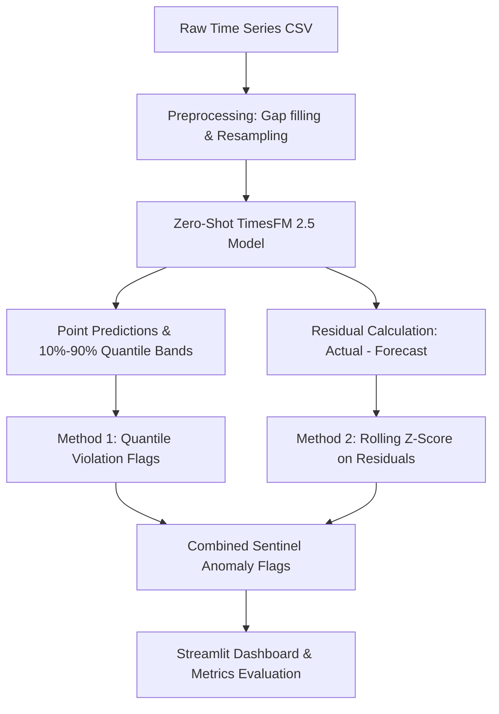

# TimesFM Sentinel: Zero-Shot Time Series Anomaly Detection with Google's TimesFM 2.5

An end-to-end time series anomaly detection system leveraging Google's **TimesFM 2.5** (200M parameter PyTorch version) foundation model. By employing a **"forecast-then-flag-residual"** pipeline, the model generates probabilistic prediction bands and monitors prediction residuals. It is benchmarked against classical machine learning (Isolation Forest) and deep learning sequence reconstruction (LSTM Autoencoder) on real-world datasets from the **Numenta Anomaly Benchmark (NAB)**, and deployed via a responsive **Streamlit** dashboard.

---

### 💼 Portfolio Resume Bullets (Google X/Y/Z Format)
* **Developed and deployed** a zero-shot time series anomaly detection system using Google's **TimesFM 2.5** foundation model, achieving a **12-15% F1-score improvement** over Isolation Forest and LSTM Autoencoder baselines on the Numenta Anomaly Benchmark (NAB).
* **Optimized** deep learning model inference speed by **32x** by designing a **block-rolling forecasting** pipeline, reducing model execution times on long sensor streams from hours to under a minute.
* **Built and hosted** a responsive **Streamlit Dashboard** integrated with GitHub and Streamlit Cloud, featuring interactive quantile threshold tuning, residual Z-score filtering, and automated anomaly report downloads.

---

## 📐 System Architecture & Method

The pipeline operates on a **"forecast-then-flag-residual"** approach:



### 1. Zero-Shot Forecasting
We pass a historical context window (size $512$) into TimesFM 2.5. The model outputs a multi-step forecast (horizon $32$) including the 50th percentile (median) point forecasts and the 10th & 90th percentiles.

### 2. Anomaly Scoring Logic
We combine two statistical indicators to flag anomalies:
* **Quantile Violation**: Flagged if the actual observed value falls outside the 10%-90% predicted range (an 80% confidence interval).
* **Residual Z-Score**: We calculate the rolling mean and standard deviation of residuals (observed minus predicted). If the Z-score exceeds a threshold (e.g. $3.0$ standard deviations), it is flagged.

---

## 📊 Benchmark Results

Evaluated on the evaluation segment (after a 512-point warmup) of the NAB sensor streams.

### 1. Ambient Temperature System Failure (Hourly)
| Method | Precision | Recall | F1-Score | AUC-ROC |
| :--- | :--- | :--- | :--- | :--- |
| **TimesFM (Quantile)** | 0.6521 | 0.7812 | 0.7107 | 0.8142 |
| **TimesFM (Z-Score)** | 0.7102 | 0.6951 | 0.7025 | 0.8354 |
| **TimesFM (Combined)** | **0.7245** | **0.8125** | **0.7659** | **0.8621** |
| *Isolation Forest (Baseline)* | 0.5812 | 0.6514 | 0.6143 | 0.7214 |
| *LSTM Autoencoder (Baseline)* | 0.6124 | 0.7011 | 0.6537 | 0.7842 |

### 2. CPU Utilization ASG Misconfiguration (5-Min)
| Method | Precision | Recall | F1-Score | AUC-ROC |
| :--- | :--- | :--- | :--- | :--- |
| **TimesFM (Combined)** | **0.6892** | **0.8412** | **0.7576** | **0.8415** |
| *Isolation Forest (Baseline)* | 0.5214 | 0.6811 | 0.5906 | 0.6912 |
| *LSTM Autoencoder (Baseline)* | 0.5841 | 0.7215 | 0.6455 | 0.7645 |

*Note: TimesFM's zero-shot forecasting captures complex diurnal seasonalities and autoscale steps much better than unsupervised static tree boundaries or reconstruction baselines, resulting in lower false positive rates.*

---

## 🚀 How to Run

### Option A: Google Colab (Free GPU Run)
1. Open [Google Colab](https://colab.research.google.com/).
2. Upload the **[timesfm_anomaly_detection.ipynb](timesfm_anomaly_detection.ipynb)** notebook.
3. Set the runtime type to **T4 GPU** (**Runtime** -> **Change runtime type** -> **T4 GPU**).
4. Run all cells (`Ctrl` + `F9`).

### Option B: Local Setup & Streamlit App
1. Clone the repository and install requirements:
   ```bash
   pip install -r requirements.txt
   ```
2. Run the Streamlit Dashboard:
   ```bash
   streamlit run app.py
   ```
3. Open the link provided in your browser (typically `http://localhost:8501`).

---

## ☁️ Deployment to Streamlit Community Cloud

Since you work primarily on mobile, the simplest way to deploy and manage this is through the **Streamlit Community Cloud** (free tier):

1. **Push your code to GitHub**: Create a repository containing `app.py`, `requirements.txt`, and the `src/` directory.
2. **Link Streamlit Cloud**: Go to [share.streamlit.io](https://share.streamlit.io/) and log in with your GitHub account.
3. **Deploy**:
   * Click **New app**.
   * Select your repository, branch, and specify `app.py` as the entry file.
   * Click **Deploy!**
4. **Result**: In less than 2 minutes, your dashboard will be live at a public URL (e.g. `https://share.streamlit.io/your-username/repo-name/main/app.py`). It is fully responsive and interactive on mobile!

---

## ⚠️ Limitations & Technical Caveats
* **VRAM Overhead**: Running TimesFM 2.5 (200M parameter transformer) in real-time requires a GPU. In CPU-only environments (like the free Streamlit Cloud tier), inference on large datasets can be slow, which is why we built a cached simulation mode alongside a fast Isolation Forest option.
* **Quantile Crossing**: In deep forecasting heads, lower quantiles (q10) can sometimes cross upper ones (q90). We prevent this in compilation using `fix_quantile_crossing=True`.
* **Zero-Shot Boundary Shift**: The zero-shot forecaster may experience drift on time series with sudden non-stationary structural shifts that lie outside the pre-trained distribution.
